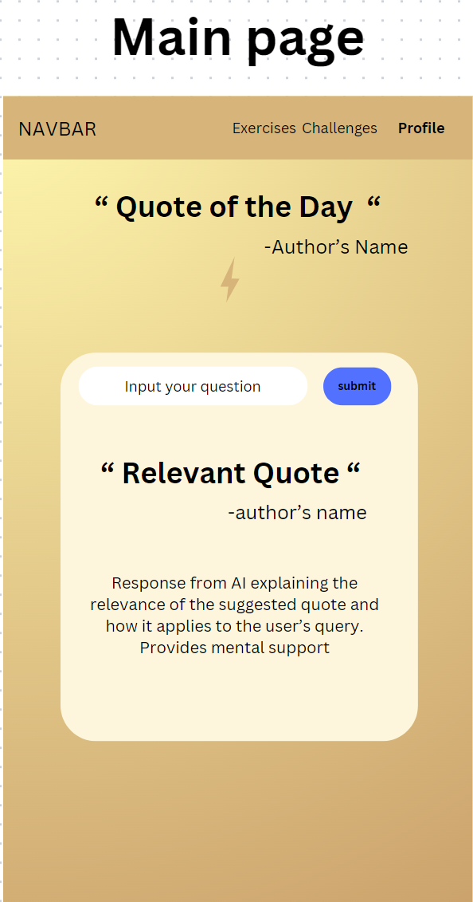
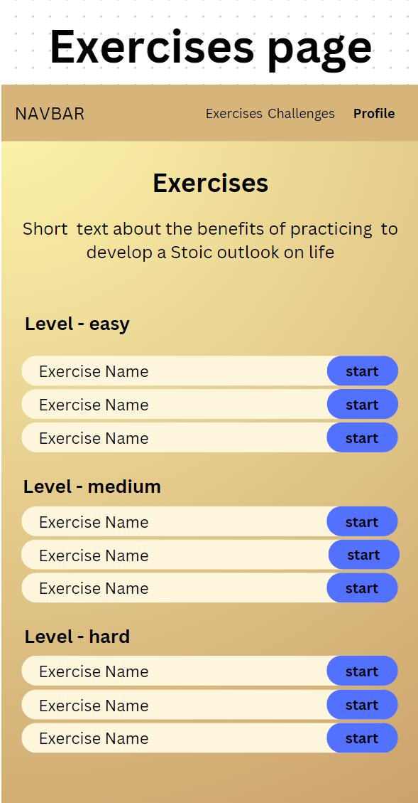
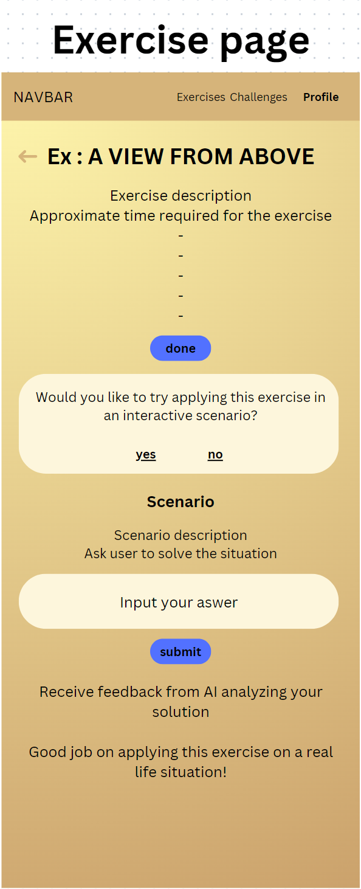
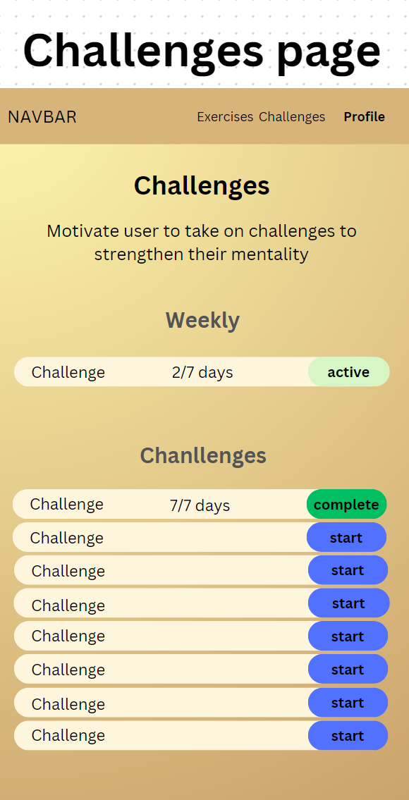

# Project Title

Stoic: Your Personal Stoicism Companion

## Overview

Stoic is a mental health app that leverages Stoic philosophy to provide users with daily inspiration, personalized advice, and practical exercises for mental resilience and well-being.

### Problem

In today's fast-paced and often stressful world, many people struggle with maintaining mental well-being and finding effective, practical strategies to deal with challenges like anxiety, stress, and negative emotions. Traditional mental health apps may offer generic advice that doesn't resonate with everyone's needs or philosophical outlook.

### User Profile

Individuals interested in Stoicism or looking for philosophical ways to improve mental health.
People facing daily life challenges who seek practical advice and exercises to build resilience, calm, and emotional intelligence.
Users who enjoy reflective practices like journaling, meditation, and thoughtful engagement with philosophical texts.

### Features

- As a user, I want to receive a random Stoic quote daily for inspiration and reflection.
- As a user, I want to input my current issues and receive personalized advice based on Stoic philosophy, including relevant quotes and detailed guidance.
- As a user, I want to choose specific Stoic exercises to practice daily, such as resilience, calm, discipline, acceptance etc to improve my mental well-being.
- As a user, I want to engage in interactive scenarios where I can make decisions based on Stoic principles and receive feedback to enhance my understanding and application of Stoicism.
- As a user, I want to participate in Stoic Challenges that encourage me to apply Stoic principles in my life for a certain period and track my progress.
- As a user, I want to save my favorite quote and track my activities and progress.

## Implementation

### Tech Stack

- React (Later React Native for cross-platform mobile app development).
- Node.js and Express for the backend server.
- MySQL
- Express
- Client libraries:
    - react
    - react-router
    - axios
- Server libraries:
    - knex
    - express
    - bcrypt for password hashing

### APIs

External API for random quotes - https://github.com/tlcheah2/stoic-quote-lambda-public-api
External openAI API for advice and interactive scenarios
Internal API to manage user accounts, stoic exercises and challenges, user inputs, responses.
Potential future integration with mindfulness and meditation content providers.

### Sitemap

- Home Page (Daily Quote, User Input for Advice)
- Daily Stoic Exercises Selection
- Exercise Page with Interactive Scenarios
- Stoic Challenges
- Profile/Account Management

### Mockups

#### Home Page with Daily Quote and Personalized Advice Input Component

#### Daily Stoic Exercises Selection Page

#### Exercise Page with Interactive Scenarios

#### Stoic Challenges Page

### Data

### Endpoints

**GET /quotes/daily**

Fetches the daily Stoic quote.

Response:
{
"quote": "The impediment to action advances action. What stands in the way becomes the way.",
"author": "Marcus Aurelius"
}

**POST /advice**

Receives user input and returns relevant Stoic advice.

Request:
{
"issue": "feeling overwhelmed from overworking but not being able to reduce work hours due to financial difficulties"
}

Response:

{
"quote": "You have power over your mind - not outside events. Realize this, and you will find strength.",
"author": "Marcus Aurelius",
"advice": "When feeling overwhelmed, focus on one task at a time..."
}

**GET /exercises**

Lists available Stoic exercises for the user to practice.

Response:
[ { "title": "Resilience", "description": "Exercise to strengthen your ability to face challenges..." }, ...]

**GET /scenarios**

Fetches interactive scenarios for decision-making practice.
Response as a json file so I can grab scenario and feedback separately

Response:
[ { "scenario": "You're stuck in traffic and running late.", "options": ["Option A: Practice patience...", "Option B: Reflect on what's in your control..."],
"feedback": ["Feedback for Option A...", "Feedback for Option B..."]
},
...
]

**POST /scenarios**

Send user's solution to AI for analysis

**GET /challenges**

Lists Stoic challenges for users to engage in.

Response:
[ { "challenge": "Week of Gratitude", "description": "Each day, reflect on three things you're grateful for..." }, ...]

**GET /profile**

Personal information:
- Level (eg 10 levels: Novice Navigator, Aspiring Apprentice, Virtue Voyager, Resilience Rookie, Tranquility Traveler, Wisdom Warrior, Equanimity Explorer, Fortitude Philosopher, Sage Seeker, Stoic Sage)
- Favorite quotes
- Complete exercises
- Accomplishements (completed challenges)

### Auth

- JWT auth
  - Before adding auth, all API requests will be using a fake user with id 1
  - Added after core features have first been implemented
  - Store JWT in localStorage, remove when a user logs out
  - Add states for logged in showing different UI in places listed in mockups

## Roadmap

**Roadmap Overview**

- Initial development of the app with React, including basic UI and navigation.
- Setup of the backend server with Node.js and Express, including API endpoints for quotes, advice, exercises, scenarios, and challenges.
- Integration of local file for storing user data, quotes, and exercises.
- Implementation of user authentication and profile management.
- Development of the Daily Stoic Exercises, Interactive Scenarios, and Stoic Challenges features.
- Testing and refining the app based on user feedback.

**Roadmap Breakdown**

- Create client
    - react project with routes and boilerplate pages

- Create server
    - express project with routing, with placeholder 200 responses

- Create migrations

- Gather 20 exercises and 10 challenges from Stoicism practices

- Create seeds with exercises and challenges data

- Deploy client and server projects so all commits will be reflected in production

- Feature: List exercises
    - Implement list exercises page
    - Create GET /exercises endpoint

- Feature: Exercise page
    - Implement exercise page
    - Create GET /exercises/:id endpoint
    - Add interactive scenario component
    - Create GET /exercises/:id/scenario
    - Create POST /exercises/:id/scenario

- Feature: List challenges
    - Implement list challenges page
    - Create GET /challenges endpoint

- Feature: View profile
    - Implement profile page
    - Create GET /profile

- Feature: main page
    - Add random quote to the main page
    - Create GET/quote
    - Add input form to intake user issue they need advice for
    - Create POST /advice
    - Output received advice

Optional:

- Feature: Create account (optional)
    - Implement register page + form
    - Create POST /users/register endpoint

- Feature: Login (optional)
    - Implement login page + form
    - Create POST /users/login endpoint

- Feature: Implement JWT tokens (optional)
    - Server: Update expected requests / responses on protected endpoints
    - Client: Store JWT in local storage, include JWT on axios calls

- Bug fixes

- DEMO DAY

## Nice-to-haves

- Integration with wearable devices to remind users of daily exercises and track stress levels.
- Social sharing features to share quotes, progress in challenges, and personal reflections.
- Gamification elements to motivate users to consistently engage with the app (badges, streaks).
- Personalized insights and progress reports to show users how their well-being has improved over time.
- Community features to connect users with similar interests or challenges.
- Diary for recording thoughts and experience.
